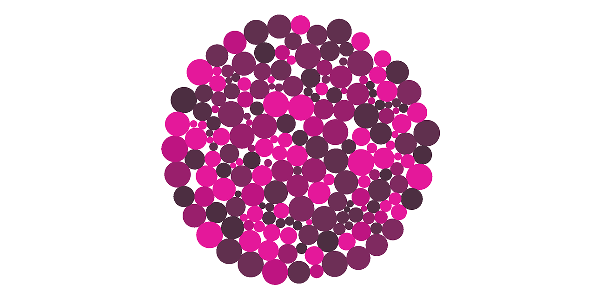

# @thisisgrow/circlepack

Packs circles into a larger circle container using physics.



[View demo](https://growcode.github.io/circlepack/).

## Usage

Internally, CirclePackManager stores points in a flat Float32Array in the form of `[x, y, x, y, x, y, ..]`. This allows us to be efficient when sending data to WebGL or (in the future) return data from workers. This also means that the number of points has to be known in advance because Float32Arrays sizes are static.

Create a manager:

```
const circlePackManager = new CirclePackManager({
  size: pointCount, // number of points, defaults to 100
  center: new Vector2(0, 0), // optional, defaults to [0, 0]
  onUpdate: () => {
    // optional update callback. example use case might be to update
    // DOM overlays, update webgl geometry attribute flags, etc.
  }
});
```

Add a bunch of points:

```
for (let i = 0; i < pointCount; i += 1) {
  circlePackManager.addPoint(
    Math.random() - .5 * 200, // x position
    Math.random() - .5 * 200, // y position
    Math.random() * 10,       // radius
  );
}

circlePackManager.calculateArea(); // required!
```

Finally, update the system on each frame:

```
circlePackManager.update();
```


To reset a manager, you can call `reset` along with the size to reinitialize point arrays:

```
circlePackManager.reset(pointCount);
```

## Roadmap
- Optional workers
