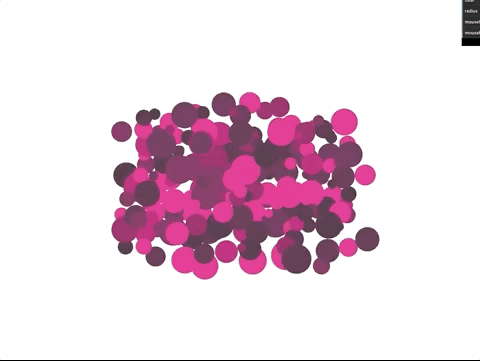

# @thisisgrow/circlepack

Packs circles into a larger circle container using physics.



([Click here for a live demo](https://circlepack.static.thisisgrow.com/))

## Usage

Create a manager with a center value:

```
const circlePackManager = new CirclePackManager({
  center: new THREE.Vector2(0, 0),
  onUpdate: () => {
    // optional update callback. example use case might be to update label
    // overlays, update webgl geometry attribute flags, etc.
  }
});
```

Create an array to store position values. This uses a flat array in the form of `[x, y, x, y, x, y, ..]` in order to be efficient when sending data to/from workers or WebGL.

`const points = new Float32Array(pointCount * 2);`

Add a bunch of points:

```
for (let i = 0; i < pointCount; i += 1) {
  circlePackManager.points.push(new CirclePackPoint({
    x: Math.random() - .5,
    y: Math.random() - .5,
    radius: Math.random() * 10,

    // these values are used as references and for sending data back to main.
    // a future version will let the manager handle adding these things directly.
    manager: circlePackManager,
    index: i * 2, // x2 because we have to account for x and y positions
    pointsArray: points
  }));
}
```

After all of your points are added, tell the manager to calculate volume:

```
circlePackManager.calculateVolume();
```

Finally, update the system on each frame:

```
circlePackManager.update();
```

## Roadmap
- Let CirclePackManager handle `pointsArray` rather than maintaining it in the parent scope.
- Optional workers
